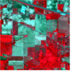
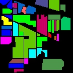
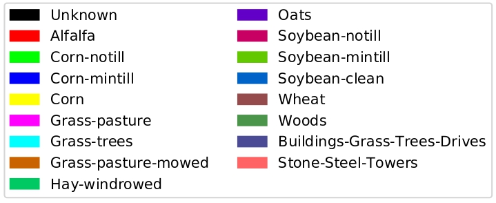

# Area Estimation Using Hyperspectral/Multispectral Images

## Overview

This project focuses on the classification and area estimation of hyperspectral and multispectral images using Convolutional Neural Networks (CNN) and Principal Component Analysis (PCA). Hyperspectral imaging involves capturing image data across multiple wavelengths, providing detailed spectral information that human eyes cannot capture. The project implements a Hybrid Spectral-Spatial 3D-CNN followed by a spatial 2D-CNN for hyperspectral image classification, along with PCA for feature extraction.

## Hyperspectral and Multispectral Imaging

- **Hyperspectral Imaging**: Captures data across thousands of narrow spectral bands, providing rich spectral detail useful for various applications like process monitoring, quality inspection, and environmental analysis.
- **Multispectral Imaging**: Captures data across a few broad spectral bands, typically between 3 to 10 bands, often used in applications like remote sensing and agriculture.

## Software and Libraries Used

- **Keras**: Used for implementing 2D and 3D convolutional layers, batch normalization, model training, and creating model checkpoints.
- **Sklearn and Matplotlib**: Used for PCA algorithm implementation, dataset splitting, confusion matrix creation, and plotting images.
- **Numpy and Scipy**: Numpy is used for array operations, while Scipy's `io` module is utilized for scientific computations.
- **OS and Spectral**: OS module handles file operations, and Spectral is a Python module for reading, manipulating, and classifying hyperspectral image data.

## Datasets

The project uses three hyperspectral datasets and one multispectral dataset:

- **Indian Pines Dataset**: Contains 145x145 pixels, 224 spectral bands, and 16 classes.
- **Salinas Dataset**: Contains 512x217 pixels, 224 spectral bands, and 16 classes.
- **Pavia University Dataset**: Contains 610x610 pixels, 103 spectral bands, and 9 classes.
- **Multispectral Dataset**: Provided in TIFF format and converted to CSV for processing.

## Data Processing

1. **Load Dataset**: The dataset is loaded using the `loadData(name)` method.
2. **Split Dataset**: The dataset is split into training and testing sets using `splitTrainTestSet(X, y, testRatio)`.
3. **Apply PCA Algorithm**: PCA is applied to reduce the dataset's features from 200 to 30 important features.
4. **Create Image Cubes**: The dataset is converted into 3D format using the `createImageCubes(X, y, windowSize)` method.

## Model and Training

The CNN model consists of input, convolutional, and fully connected layers:

1. **Input Layer**: Specifies the shape of the input data.
2. **Convolutional Layers**: Apply filters to extract image features, using multiple layers with varying kernel sizes.
3. **Fully Connected Layer**: Interprets the features and performs the final classification.

The model is trained and validated using the split datasets, and the performance is evaluated using accuracy metrics, including overall accuracy, kappa accuracy, and average accuracy.

## Results

### Indian Pines (IP) dataset

   

Fig.2  The IN dataset classification result (Overall Accuracy 99.81%) of Hybrid-SN using 30% samples for training. (a) False color image. (b) Ground truth labels. (c) Classification map. (d) Class legend. 

## Conclusion

This project demonstrates the successful implementation of a CNN-based model for hyperspectral image classification and area estimation. The use of PCA for feature extraction and the conversion of datasets into 3D format were critical in achieving high accuracy.

